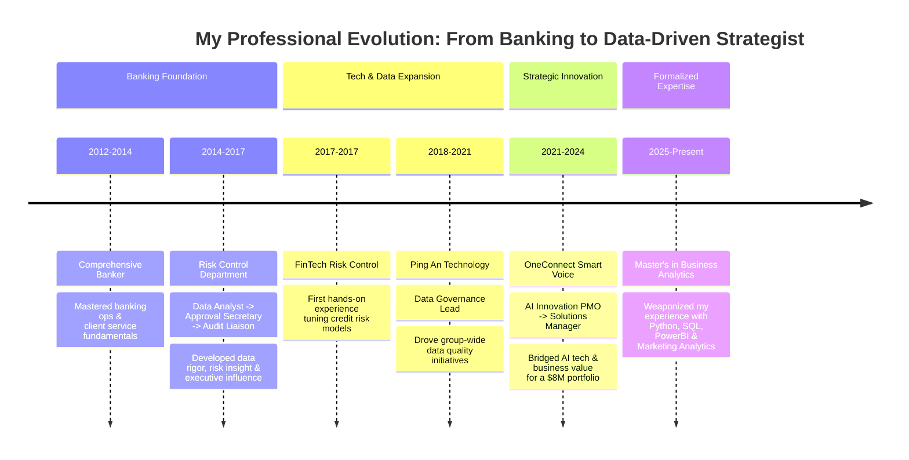

```mermaid
timeline
    title My Professional Evolution: From Banking to Data-Driven Strategist
    section Banking Foundation
        2012-2014 : Comprehensive Banker
                  : Mastered banking ops &<br>client service fundamentals
        2014-2017 : Risk Control Department
                  : Data Analyst -> Approval Secretary -> Audit Liaison
                  : Developed data rigor, risk insight & executive influence
    section Tech & Data Expansion
        2017-2017 : FinTech Risk Control
                  : First hands-on experience<br>tuning credit risk models
        2018-2021 : Ping An Technology
                  : Data Governance Lead
                  : Drove group-wide data quality initiatives
    section Strategic Innovation
        2021-2024 : OneConnect Smart Voice
                  : AI Innovation PMO -> Solutions Manager
                  : Bridged AI tech & business value<br>for a $8M portfolio
    section Formalized Expertise
        2025-Present : Master's in Business Analytics
                  : Weaponized my experience with<br>Python, SQL, PowerBI & Marketing Analytics
```
